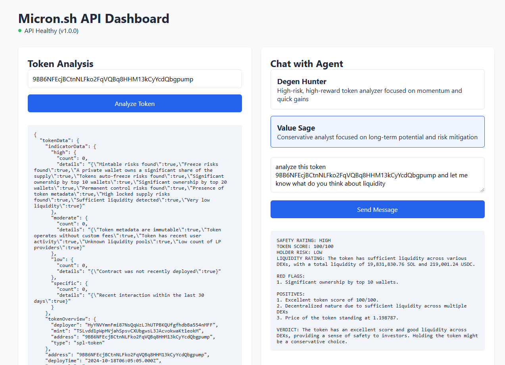

# 🚀 Micron.sh API Demo Dashboard

[](https://api.micron.sh/health)

> A minimal, single-page demo implementation of the Micron.sh API, showcasing token analysis and AI agent interactions.

## Demo

<p align="center">
  
</p>

## Features

- **Token Analysis** - Quick Solana token lookup and risk assessment
- **AI Chat Interface** - Interactive conversations with specialized AI agents
- **Live Status** - Real-time API health monitoring
- **Zero Dependencies** - Built with vanilla JavaScript and CSS

## Implementation

This demo consists of just two files:

```plaintext
├── index.html    # Single-page interface with embedded CSS
└── assets/
    └── js/
        └── app.js  # API integration and UI interactions
```

## Usage

### Token Analysis
Enter any Solana token address to get detailed analytics:
- Token overview
- Risk indicators
- Market data
- Liquidity information

### AI Agent Chat
1. Select an available agent from the list
2. Type your question about Solana tokens
3. Get AI-powered insights and analysis

## API Integration

The demo implements these Micron.sh API endpoints:

| Endpoint | Purpose |
|----------|---------|
| `/health` | API status monitoring |
| `/v1/token/{address}` | Token analysis |
| `/v1/agents` | Available AI agents |
| `/v1/agents/{id}/chat` | AI interactions |


## Quick Start

1. **Download the files**
```bash
git clone https://github.com/micronsh/micron-api-demo.git
```

2. **Serve the files**
```bash
# Using any static file server
npx serve .
```

3. Open `http://localhost:3000` in your browser

## Notes

- This is a demo implementation - for production use, implement proper error handling and security measures
- API keys should be managed securely in a production environment
- The demo uses the public API endpoint at `api.micron.sh`

## Resources

- [Micron.sh Documentation](https://docs.micron.sh)
- [Micron Typescript SDK](https://github.com/micronsh/micron-sdk)

---